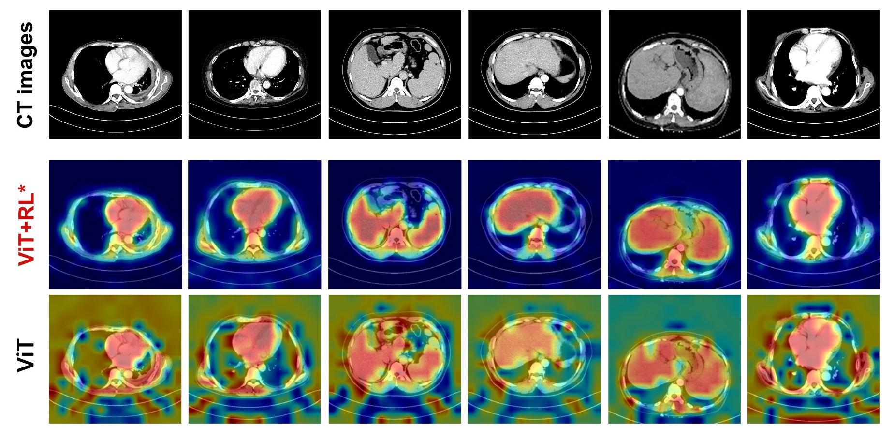

 Hello👋, I'm Tengfei Li ( AKA. 李腾飞). I am a three-year Master's candidate in Artificial Intelligence at Sichuan University, building upon my undergraduate foundation in IoT Engineering at Zhengzhou University (a 211 Project institution). My research focuses on ​​**Human-Centric AI**​​, specifically advancing ​​Motion Understanding​​ and Generation​​ for digital human and game applications.

My research intersects ***Machine Learning***, ***Computer Vision***, ***Multimodal***, ***Meta Human*** and ***AIGC***, with active exploration of:

+ Text-driven real-time digital human interaction frameworks
+ Cross-modal alignment with uncertainty estimation techniques for pose reconstruction
+ High accuracy video motion capture for biomechanics analysis

I'm passionate about developing AI systems that bridge virtual and physical movement, with publications and projects addressing occlusion-robust pose analysis and synthesis. 

For detailed credentials including publications, projects and demos, please visit my portfolio: [CV Page](https://ltf-coding.github.io/cv/). For convenience, I copy it below.

--------------
--------------

## 🎯 Research Focus

My core research agenda centers on **human-centric artificial intelligence**, with specialized expertise in:
+ 🕴️ **Human Pose Estimation**:  `3D Reconstruction`  `Occlusion Handling`   `MultiModel Methods`
+ 💃 **Motion Synthesis & Generation**: `Interactive`  `Text-Driven Control` `Long-Sequence Generation`
+ 👟 **Video Motion Capture System**: `Multi-View` `High Accuracy` `Biomechanical Analysis`

------

## ⚙️ Technical Arsenal
+ **Meta Human:** `Stable Diffusion` `DiT` `VAE` `PPO` `Controllable`
+ **3D Vision:**  `Mesh` `Motion Synthesis` `3D Pose Reconstruction` 
+ **Motion Capture:**   `Multi-View` `Marker-less` `Biomechanics Analysis`​​
+ Multimodal:  `Image`  `Text` `Motion`
+ Animation:  `Blender`  `IK/FK`  `Rotation` `Ragging`
+ Optimization: `KV Cache` `LoRA` `Noise Strategy` `CFG`

-------

## 🚀 Key Projects
### 💃 **Self-Forcing Autoregressive Diffusion for Real-Time Text-Driven Motion Generation**
`AutoRegress Diffusion`    `DiT`    `Reinforcement Learning (PPO)`    `Real-time Control`
+ ✅ SOTA Performance: Achieved 300+ FPS with KV Cache acceleration
+ ✅ Enabled continuous long-sequence generation via novel self-forcing paradigm
+ ✅ Balanced quality/speed via noise scheduling & annealing strategies

<!-- <figure style="text-align: center;">
  <video controls width="80%" src="../assets/demos/MoGenRT_480p.mp4"></video>
  
  <figcaption style="font-style: italic; color: #666;">real-time video demo</figcaption>
</figure> -->

<!-- <figure style="text-align: center;">
  <video controls width="80%" src="../assets/demos/MoGenRT_480p.mp4"></video>
  
  <figcaption style="font-style: normal; color: #333; font-weight: bold; text-align: center;">
  real-time video demo
     
    
      Technical Note: This implementation is based on
      <a href="https://github.com/zkf1997/DART" target="_blank" 
         style="color: #0056b3; text-decoration: none; border-bottom: 1px dashed #0056b3;">
        DART
      </a>.
      Compared to DART, our method achieves more stable results through wider receptive fields while maintaining comparable frame rates.
    
  </figcaption>
</figure> -->

  <figure style="text-align: center;">
    <video 
      controls 
      width="100%" 
      style="border: 1px solid #eee; border-radius: 4px;"
      src="../assets/demos/MoGenRT_480p.mp4">
    </video>
    <figcaption style="display: block; width: 100%; box-sizing: border-box; padding: 10px 20px; margin-top: 0; text-align: center;">
      

        Real-Time Video Demo
      

    </figcaption>
  </figure>

<!-- [Download Demo Video](https://githupb.com/user-attachments/assets/f8614513-d844-493e-8da8-54cf536d6116) -->

---

### 🌐 [**MetaPose: Multimodal Enhancement and Transformation Alignment 3D Pose Restruction**](https://github.com/LTF-coding/MetaPose)
`Vision-Text-Spatial Fusion`   `Cross-Modal Alignment`   `Occlusion Robustness`
+ ✅ **IEEE TMM (Q1)**
+ ✅ SOTA Accuracy: Outperformed video-based methods using single-frame input
+ ✅ Novel Framework: A unified distribution space for anatomical/textual/visual features

<!-- <figure style="text-align: center;">
  <video controls width="80%" src="../assets/demos/VideoDemo_480p.mp4"></video>
  
  <figcaption style="font-style: normal; color: #333; font-weight: bold; text-align: center;">
  video demo  in the wild
  </figcaption>
</figure> -->

  <figure style="text-align: center;">
    <video 
      controls 
      width="100%" 
      style="border: 1px solid #eee; border-radius: 4px;"
      src="../assets/demos/VideoDemo_480p.mp4">
    </video>
    <figcaption style="display: block; width: 100%; box-sizing: border-box; padding: 10px 20px; margin-top: 0; text-align: center;">
      

        Video Demo in the Wild
      

    </figcaption>
  </figure>

<!-- [Download Demo Video](https://github.com/user-attachments/assets/ced85a08-e4d1-4b47-9f57-2454554d4c0a) -->

---

### 👟 **Multi-View Video Capture for Biomechanics Analysis**
`ViT`   `Temporal Processing`    `Triangulation`
+ ✅**Journal of Biomechanics (Top Journal of Orthopedics)** 
+ ✅ High Accuracy: achieve the requirements of clinical biomechanical analysis.It is more accurate than the online markerless motion capture systems available on the market.

<!-- <figure style="text-align: center;">
  
  
  <figcaption style="font-style: normal; color: #333; font-weight: bold; text-align: center;">inference visualization</figcaption>
</figure> -->

  <figure style="text-align: center;">
    
    <figcaption style="display: block; width: 100%; box-sizing: border-box; padding: 10px 20px; margin-top: 0; text-align: center;">
      

        Inference Visualization
      

    </figcaption>
  </figure>

---
###  🤖 **Provably Safe Vision-Based Teleoperation for Dual-Arm Surgical Robots**
`Surgical Robot` `Gesture Control` `Teleoperation`
+ ✅ **IEEE ROBIO 2025**

  <figure style="text-align: center;">
    <video 
      controls 
      width="100%" 
      style="border: 1px solid #eee; border-radius: 4px;"
      src="../assets/demos/86872186a770eacb92a7f859d9caad5e.mp4">
    </video>
    <figcaption style="display: block; width: 100%; box-sizing: border-box; padding: 10px 20px; margin-top: 0; text-align: center;">
      

        Demonstration
      

    </figcaption>
  </figure>

---

### ⚡ [**Connection-Aware Graph Convolution Networks**](https://github.com/Visual-Pose-Lab/Connection-Aware-Graph-Pose)
`GCN`   `Anatomical/Kinematic Modeling`    `Multi-Level Aggregation` 
+ ✅ **HCIS Journal (JCR Q1, Under Review)**
+ ✅ 40% Faster than video-based approaches while maintaining SOTA accuracy

---
### 🩺 [**Reinforce Learning Enhanced CTA for Noninvasive Prediction**](https://github.com/kkkkkkosf/ViT_RL) 
`PPO`    `CTA`    `Medical Image Analysis`
+ ✅ **Liver International (JCR Q1)**
+ ✅ High accuracy rate of **identifying the ROI** area of extremely severe lesions

<figure style="text-align: center;">
  
  <figcaption style="width: 100%; text-align: center; font-style: italic; color: #666; margin-bottom: 0;">CAM visualization</figcaption>
</figure>

---

## 📜 Publications

+ **Accept:** `Liver International (Q1)`, `ROBIO 2025`, `TMM (Q1)`, `ACM MM 2026 (CCFA)`, `Journal of Biomechanics (Q2)`🥰
+ **Prepare to Submit:** `CVPR 2027 (CCFA)`

